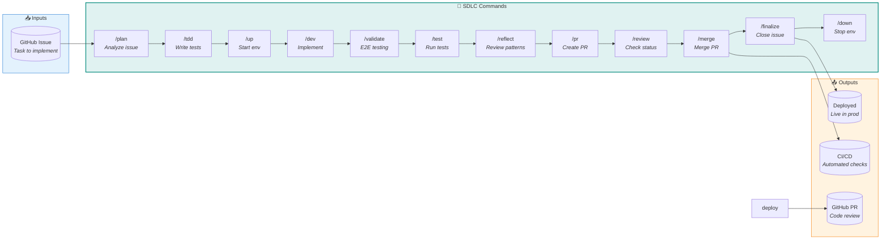

# Development Workflow Commands

Build features from GitHub issues. These commands form the development lifecycle from planning through deployment.

## SDLC Loop — How to build?



## Commands

| Command | Purpose | Input | Process | Output |
|---------|---------|-------|---------|--------|
| [`/up`](up.md) | Start dev environment | None | Supabase, Docker, health checks | Running services, `.env.local` |
| [`/down`](down.md) | Stop dev environment | `--keep-supabase`, `--volumes` | Stop containers, Supabase | Clean shutdown |
| [`/plan`](plan.md) | Analyze issue | Issue # or URL | Agent orchestration (inline) | Implementation plan, updated issue |
| [`/tdd`](tdd.md) | Write failing tests | Issue # or URL | tdd-guide agent | Failing test files, issue comment |
| [`/dev`](dev.md) | Feature development | Issue # or description | Agent orchestration (inline) | Code changes, tests |
| [`/test`](test.md) | Run local CI | `--quick`, `--security` | nektos/act (GitHub Actions locally) | Test results, artifacts |
| [`/validate`](validate.md) | E2E validation | Issue # | Agent orchestration (inline) | Validation report, screenshots |
| [`/reflect`](reflect.md) | Development reflection | Commits, scope | [development-reflection](../workflows/maintenance/development-reflection.md) | `docs/planning/retro/{date}-reflection.md` |
| [`/pr`](pr.md) | Create PR | Issue # | Agent orchestration (inline) | GitHub PR with review guide |
| [`/review`](review.md) | Check PR status | PR # | code-reviewer agent | Review summary, PR comments |
| [`/merge`](merge.md) | Merge PR | PR #, strategy | Pre-merge validation, `gh pr merge` | Merged PR, local sync |
| [`/finalize`](finalize.md) | Close issue | Issue # | Agent orchestration (inline) | Issue closed, prompting log |
| [`/team-dev`](team-dev.md) | Parallel batch processing | Issue #s (space-separated) | Agent Teams orchestration | Waves of parallel PRs, merged sequentially |
| [`/autodev`](autodev.md) | Autonomous dev sweep (daily routine) | None | MCP-native: plan → tests → implement → `tsc --noEmit`+`lint:copy`+`validate:poses`+`lint:telemetry`+`test:coverage` → browser-validate via `playwright-cli` → PR → review on `ready-for-dev` issues (no Docker/`/up`/`/test`-act; no E2E tests authored) | Auto-merged PRs on `main` (squash); failures held `auto/dev-failure` |

## Autonomous routine

`/autodev` (namespaced `/tools:02_development:autodev`) is a hand-launched
daily session in the autonomous loop (no scheduler exists yet —
`007-autonomous-operations`'s job). It picks up the `ready-for-dev` issues that
`/autopm` produced and drives them to **auto-merged PRs on `main`** — after CI
passes it calls `mcp__github__merge_pull_request` (squash; no
`delete_branch` — no branch-cleanup workflow exists in this repo, only
`ci.yml` and `supabase-branch.yml`) without human intervention. Sensitive
files (migrations, auth, Stripe billing) are held as `auto/needs-human` unless
the issue carries an `auto-ok` label. CI failures are labeled `auto/dev-failure`
and left for review on return. It runs MCP-native and headless (GitHub MCP, not `gh`;
vitest/eslint/tsc, not Docker or `nektos/act`). See
[`docs/planning/routines.md`](../../../../docs/planning/routines.md) for the
schedule, guardrails, and revert instructions.

## Detailed Workflow

What each command does internally:

```
/up (haiku)
  └── Start dev environment
      ├── Check prerequisites (Supabase CLI, Docker, jq)
      ├── Start Supabase services
      ├── Create .env.local
      ├── Initialize database (migrations + seed)
      ├── Start Docker containers
      └── Health check all services

/plan 123 (opus)
  └── Analyze issue & create implementation plan
      ├── Fetch issue from GitHub
      ├── github-issue-analyzer agent → requirements breakdown
      ├── Explore agent → find patterns, related files, exact paths
      ├── Architecture decision (FastAPI vs PostgREST)
      ├── backend-architect agent (if FastAPI needed)
      ├── sql-pro agent (if DB changes needed)
      └── Post plan comment to issue (with testing requirements)

/tdd 123 (sonnet)
  └── Write failing tests from plan
      ├── Fetch issue + /plan comment from GitHub
      ├── Extract testing requirements (unit, integration, E2E)
      ├── Determine test file paths from plan's files-to-modify
      ├── tdd-guide agent → write failing tests
      ├── Verify tests fail (Red phase)
      ├── Post TDD summary comment to issue
      └── Output: failing tests ready, run /dev to make them pass

/dev 123 (sonnet)
  └── Implement following the plan
      ├── Fetch issue + plan comment
      ├── Extract: architecture, schema, files, steps
      ├── sql-pro agent (if DB changes in plan)
      ├── typescript-pro agent → service layer
      ├── frontend-developer agent → UI components
      ├── backend-architect agent (if FastAPI in plan)
      ├── code-simplifier agent → refine code
      ├── Create branch & commit
      ├── Push to remote
      └── Post development summary to issue

/validate 123 (haiku)
  └── Validate implementation against plan
      ├── Fetch issue + comments from GitHub
      ├── Extract E2E scenarios from /plan comment
      ├── Extract branch name from /dev comment
      ├── Auto-checkout branch if not on it
      ├── Analyze git diff (cross-reference with /dev summary)
      ├── playwright-tester agent → feature exploration
      ├── Execute E2E test scenarios from plan
      ├── Run validation checklist
      ├── Post validation report to issue
      └── Output: ready for /pr

/test (haiku)
  └── Run local CI with nektos/act
      ├── Check prerequisites (act, Docker, Supabase)
      ├── Prepare secrets from Supabase
      ├── Run backend tests (unit, API, integration)
      ├── Run frontend tests (Jest)
      ├── Run security scans (--quick skips this)
      └── Output: test results, ready for /merge

/reflect (sonnet)
  └── Capture session learnings
      ├── Gather session context (files, errors, tools used)
      ├── Phase 1: Challenge analysis (errors, debugging, blockers)
      ├── Phase 2: Pattern recognition (successful approaches)
      ├── Phase 3: Knowledge capture (codebase insights)
      ├── Phase 4: Improvement suggestions
      ├── Save report to docs/reports/reflections/
      ├── Commit reflection report
      └── Output: committed report, ready for /pr

/pr 123 (haiku)
  └── Create PR from completed work
      ├── Fetch issue + all comments from GitHub
      ├── Extract context from /plan, /dev, /validate comments
      ├── Commit any remaining uncommitted files
      ├── Push to remote (if needed)
      ├── Create PR with comprehensive description
      │   └── Pulls summary from all issue comments
      ├── Update issue labels (ready-for-review)
      │   └── Project board auto-updates to "In Review" via GitHub automation
      ├── Post "PR Created" comment to issue
      └── Output: handoff complete, ready for /down

/review 68 (opus)
  └── Review PR with full issue context
      ├── Fetch PR status and linked issue
      ├── Fetch issue comments (/plan, /dev, /validate)
      ├── Analyze review requirements
      ├── Request reviewers if needed
      ├── code-reviewer agent → automated review
      ├── Check implementation against plan
      ├── Generate review summary
      └── Output: review complete, ready for /merge

/merge 68 (haiku)
  └── Merge approved PR
      ├── Pre-merge validation (reviews, CI, conflicts)
      ├── Handle validation failures
      ├── Execute merge (default: squash)
      ├── Delete remote branch
      ├── Post-merge verification
      ├── Update local repository
      ├── Report linked issues (auto-closed)
      └── Output: merged, ready for /finalize

/finalize 123 (haiku)
  └── Complete development lifecycle
      ├── Fetch complete issue journey (all comments)
      ├── Extract /plan, /dev, /validate, /pr context
      ├── Update documentation (if needed)
      ├── Generate prompting log (local: .claude/logs/)
      ├── Post closing comment (journey summary)
      ├── Close issue with "completed" label
      └── Output: issue closed, lifecycle complete

/down (haiku)
  └── Stop development environment and reset
      ├── Stop Docker containers
      ├── Stop Supabase (unless --keep-supabase)
      ├── Checkout main branch (unless --keep-branch)
      ├── Pull latest changes from remote
      ├── Clean up volumes (if --volumes)
      └── Output: reset complete, ready for next issue
```

### Two-Person Workflow (Pro Plan Optimization)

```
[Person A - creates implementation plans in bulk with Opus]
/plan 123
Output: Posts implementation plan comment to GitHub issue

[Person B - Pro Plan user, uses Sonnet/Haiku]
/up → /tdd 123 → /dev 123 → /validate 123 → /reflect → /pr 123 → /down
Output: PR created, issue set to "In Review", env stopped
        → Notify Person A that PR is ready

[Person A - reviews with Opus]
/review 68 → /test → /merge 68 → /finalize 123
Output: Pull Request merged into main branch
```

## Workflow Patterns

| Pattern | When to Use | Commands |
|---------|-------------|----------|
| **Complete** | Full lifecycle | `/up` → `/plan` → `/tdd` → `/dev` → `/validate` → `/test` → `/pr` → `/review` → `/merge` → `/finalize` → `/down` |
| **Standard** | Typical development | `/plan` → `/tdd` → `/dev` → `/validate` → `/pr` → `/merge` |
| **Quick** | Well-defined issues | `/dev` → `/validate` → `/test` → `/pr` → `/merge` |
| **Standalone** | No GitHub issue | `/dev "feature"` → `/validate` → `/test` → `/pr` |
| **PR Only** | PR ready for review | `/pr` → `/review` → `/merge` → `/finalize` |
| **Team** | Parallel batch of issues | `/team-dev 99 100 101 102` (orchestrates waves of `/plan` → `/tdd` → `/dev` → `/pr` → `/review` → `/merge` → `/finalize`) |

## Command Parameters

### Issue-based Commands
- Accept issue numbers: `123`
- Accept issue URLs: `https://github.com/user/repo/issues/123`
- Accept hash format: `#123`

### PR-based Commands
- `/review <pr>` - PR number required
- `/merge <pr>` - PR number required
- `/merge <pr> --strategy squash|merge|rebase` - Optional merge strategy (default: squash)

### Feature-based Commands
- `/dev "Add temperature monitoring"` - Quote descriptions with spaces
- `/dev 123` - Or use issue number

### Test Flags
- `/test` - Full test suite
- `/test --quick` - Fast subset
- `/test --security` - Security-focused tests

## Output Locations

```
.claude/reports/
├── reflections/
│   └── YYYY-MM-DD.md      # Development retrospectives
└── validations/
    └── {issue}-{date}.md  # E2E validation reports

docs/planning/
└── audits/                # Referenced by /plan for context
```

## Handoff to Observation Loop

After `/finalize` merges and closes the issue, production monitoring begins:

```
SDLC Loop: /finalize closes #123
    ↓
Observation Loop: /status → /slo → /metrics → /ux → /digest
```

The SDLC loop handles **how** to build. The Observation loop monitors **is it working**.

## Context Efficiency Guidelines

> **Context Rule**: Inline agent selection in command files. Only create separate workflow files when 3+ commands share identical orchestration logic.

### When to Inline vs Separate

| Scenario | Approach |
|----------|----------|
| Command-specific logic | **Inline** in command file |
| Shared by 3+ commands | **Separate** workflow file |
| Complex multi-agent orchestration (single command) | **Inline** with tables |
| Reusable decision frameworks | **Separate** workflow file |

### Why This Matters

Each workflow file reference costs:
- Additional file read operation
- Token overhead for parsing references
- Potential for context fragmentation
- Increased chance of LLM losing track of instructions

The `/dev` command demonstrates the inline pattern: agent selection logic is embedded directly in `dev.md` rather than referencing an external workflow file.
