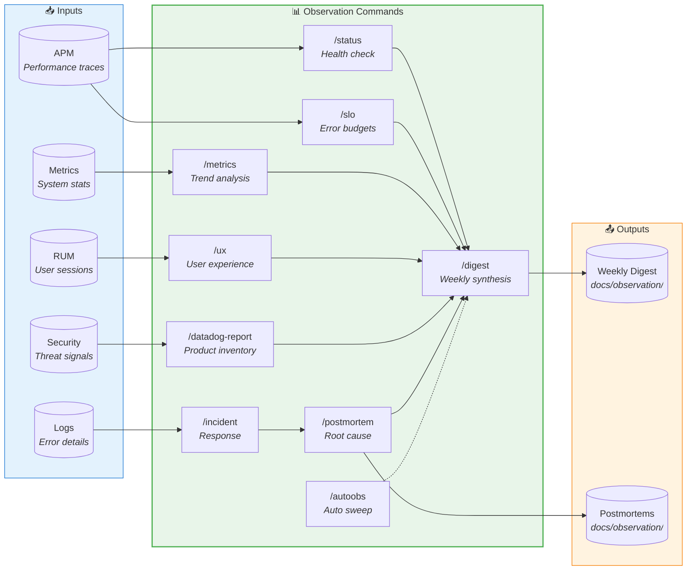

# Observation Workflow Commands

Monitor production and close the feedback loop. These commands surface insights that feed back into PM planning.

## Observation Loop — Is it working?



## Commands

| Command | Purpose | Input | Process | Output |
|---------|---------|-------|---------|--------|
| [`/status`](status.md) | System health check | None | Health endpoints, alert queries | Service status table, trends |
| [`/slo`](slo.md) | Error budget tracking | Service (optional) | 30-day SLO calculation, burn rate | Budget table, forecast |
| [`/metrics`](metrics.md) | Trend analysis | Scope (optional) | 4-week baseline, anomaly (>2σ) | Metric tables, anomaly report |
| [`/ux`](ux.md) | User experience | None | RUM data, journey completion | Session stats, UX score |
| [`/incident`](incident.md) | Incident response | `new` or ID | Severity classification, timeline | `docs/observation/incidents/INC-{id}.md` |
| [`/postmortem`](postmortem.md) | Incident postmortem | Incident ID | 5 Whys, impact calculation | `docs/observation/postmortems/PM-{id}.md` |
| [`/datadog-report`](datadog-report.md) | Product inventory | None | Discovers all Datadog products, gathers metrics | `docs/observation/datadog-reports/{date}.md` |
| [`/digest`](digest.md) | Weekly synthesis | None | Aggregates metrics, UX, incidents, security | `docs/observation/digests/{date}.md` |
| [`/autoobs`](autoobs.md) | Autonomous daily sweep (queries Datadog directly, no chained subcommands) | None | Monitors, SLOs, Core Web Vitals/RUM error rate, API error rate/latency, synthetic uptime, dashboard reachability | `docs/observation/autoobs/{date}.md` |

## Core Principle: Signal Over Noise

All commands query **aggregated, trend-based metrics** to surface meaningful patterns:

- **Statistical baselines**: Compare against 4-week rolling averages
- **Percentile focus**: Use p50, p95, p99 instead of individual requests
- **Week-over-week deltas**: Surface patterns, not transient spikes
- **Impact categorization**: User-affecting issues prioritized over infra noise
- **Significance threshold**: Only surface >2σ deviations from baseline

## Workflow Patterns

| Pattern | When to Use | Commands |
|---------|-------------|----------|
| **Weekly Cycle** | Standard observation | `/status` → `/slo` → `/metrics` → `/ux` → `/datadog-report` → `/digest` |
| **Product Discovery** | Check available Datadog products | `/datadog-report` |
| **Incident Response** | When alerts fire | `/incident new` → Resolution → `/postmortem {id}` |
| **Full Sweep** | Autonomous mode (hand-launched daily) | `/tools:03_observation:autoobs` |

## Command Parameters

| Command | Accepts | Examples |
|---------|---------|----------|
| `/status` | No arguments | `/status` |
| `/slo` | Optional service filter | `/slo`, `/slo api`, `/slo edge-functions` |
| `/metrics` | Optional scope | `/metrics`, `/metrics frontend`, `/metrics database` |
| `/ux` | No arguments | `/ux` |
| `/incident` | `new` or incident ID | `/incident new`, `/incident INC-42` |
| `/postmortem` | Incident ID (required) | `/postmortem INC-42` |
| `/datadog-report` | No arguments | `/datadog-report` |
| `/digest` | No arguments | `/digest` |
| `/autoobs` | No arguments | `/tools:03_observation:autoobs` |

## Output Locations

```
docs/observation/
├── autoobs/
│   └── YYYY-MM-DD.md      # /autoobs daily digest (monitors, SLOs, RUM, synthetics)
├── datadog-reports/
│   └── YYYY-MM-DD.md      # Datadog product inventory reports
├── digests/
│   └── YYYY-MM-DD.md      # Weekly synthesis reports
├── incidents/
│   └── INC-{id}.md        # Incident documentation
└── postmortems/
    └── PM-{id}.md         # Postmortem analyses
```

## Datadog Integration

Service: **`yogakit`**. Site: **us5.datadoghq.com**.

**Environment variables** (in `.env` and Vercel env):
- `DD_API_KEY` — Datadog API key
- `DD_APP_KEY` — Datadog application key
- `DD_SITE=us5.datadoghq.com`

**Datadog products we use:**
- APM (service traces, latency, error rates)
- RUM (user sessions, Core Web Vitals, action events)
- Infrastructure (CPU, memory, host state)
- Logs (structured JSON logs from `src/lib/logger.ts`)
- Monitors (alert definitions; defined as JSON manifests in `datadog/`, synced via `scripts/datadog/sync.mjs`)
- SLOs (error budgets; defined as JSON manifests in `datadog/`, synced via `scripts/datadog/sync.mjs`)
- Synthetics (API + browser tests)
- Security Monitoring (signals, rules)
- Dashboards

## pup CLI: the standard query interface

All observation commands query Datadog through [pup](https://github.com/DataDog/pup), Datadog's first-party CLI. **Do not call the Datadog API directly with curl.** Pup handles auth, token refresh, JSON output, and works identically for humans and agents.

Canonical pup reference: see `docs/OBSERVABILITY.md`.

### Install (one-time)

```bash
brew tap datadog-labs/pack
brew install datadog-labs/pack/pup
```

### Auth

```bash
export DD_SITE="us5.datadoghq.com"
pup auth login        # OAuth (preferred)
pup auth status       # confirm
```

API-key fallback (CI / headless):

```bash
export DD_API_KEY="..." DD_APP_KEY="..." DD_SITE="us5.datadoghq.com"
```

### Command-to-pup mapping

| Slash command | Primary pup commands |
|---|---|
| `/status` | `pup monitors list`, `pup events list`, `pup apm services` |
| `/slo` | `pup slos list`, `pup slos status <id>`, `pup slos get <id>` |
| `/metrics` | `pup metrics query --query "..." --from 1h`, `pup metrics search` |
| `/ux` | `pup rum sessions --query "..."`, `pup rum metrics`, `pup rum apps` |
| `/incident` | `pup logs search --query "..."`, `pup incidents list`, `pup incidents get <id>` |
| `/postmortem` | `pup logs search`, `pup traces search`, `pup rum sessions`, `pup incidents get <id>` |
| `/datadog-report` | `pup` (multiple subcommands across all product domains) |
| `/digest` | aggregates output from `/status`, `/slo`, `/metrics`, `/ux` |

### Common query patterns

```bash
# Metric query (last hour)
pup metrics query --query "avg:trace.next_js.BaseServer.handleRequest.errors{service:yogakit,env:prod}.as_rate()" --from 1h

# Log search (errors for a user, last 24h)
pup logs search --query "service:yogakit level:error @usr.id:<user-uuid>" --from 24h

# RUM session search (action events)
pup rum sessions --query "@type:action service:yogakit" --from 7d

# APM service status
pup apm services -o table

# SLO status
pup slos list -o table
pup slos status <slo-id>

# Active monitors
pup monitors list -o table

# Recent events / alerts
pup events list --from 24h
```

Pipe with `jq` for filtering (default output is JSON), or use `-o table` for terminal-readable output.

### Datadog UI quick links

| Resource | URL |
|---|---|
| APM Services | https://us5.datadoghq.com/apm/services |
| APM Traces | https://us5.datadoghq.com/apm/traces |
| RUM Sessions | https://us5.datadoghq.com/rum/sessions |
| RUM Performance | https://us5.datadoghq.com/rum/performance |
| Error Tracking | https://us5.datadoghq.com/rum/error-tracking |
| Logs | https://us5.datadoghq.com/logs |
| Monitors | https://us5.datadoghq.com/monitors/manage |
| SLOs | https://us5.datadoghq.com/slo |
| Security Signals | https://us5.datadoghq.com/security |
| Dashboards | https://us5.datadoghq.com/dashboard/lists |

### YogaKit-specific filters

```bash
# Service
service:yogakit

# Environment (not env:production — this org uses env:prod)
env:prod

# RUM application scoping (in addition to service:yogakit)
@application.id:${NEXT_PUBLIC_DD_RUM_APPLICATION_ID}

# User
@usr.id:<user-uuid>

# Errors
status:error                  # logs
@type:error                   # RUM
@http.status_code:>=500       # APM
```

## Handoff to PM Loop

Observation digests inform the next planning cycle:

```
Observation Loop: /digest creates docs/observation/digests/{date}.md
    ↓
PM Loop: /audit reads digests → /vision → /roadmap
```

The Observation loop monitors **is it working**. The PM loop decides **what to build next**.
